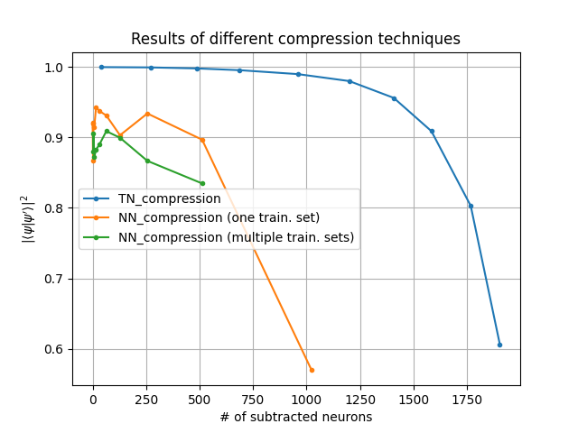
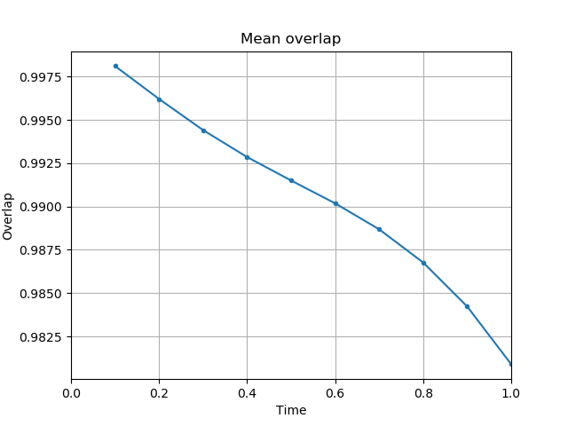

# nn_evolution

# Installation

To run the whole code we need to install Tensorflow, Keras and TeNPy:


```python
# Requires the latest pip
pip install --upgrade pip

######## Tensorflow ########

# Current stable release for CPU and GPU
pip install tensorflow

######## Keras ########

pip install keras

######## TeNPy ########

pip install physics-tenpy
```

_______________

# Structure of the library

All scripts are organized in the following way:


```python
.
|- nn_evolution
|             |
|             |-data_generation
|             |              |
|             |              |-exact_diag_and_operators_generation.py  
|             |              |-exact_evol_and_sets_generation.py  
|             |              |-exact_properties_calculation.py  
|             |              |-model.py
|             |
|             |-neural_netorks
|             |              |
|             |              |-test_evol_compress.py  
|             |              |-test_evol_simple.py
|             |              |-test_input_recreation_compress.py
|             |              |-test_input_recreation_simple.py  
|             |              |-train_evol_compress.py  
|             |              |-train_evol_simple.py    
|             |              |-train_input_recreation_compress.py  
|             |              |-train_input_recreation_simple.py
|             |
|             |-tensor_netorks
|             |              |-MPS_evolution.py
|             |              |-MPS_input_recreation.py
|             |
|             |-tools
|                   |-misc.py 
|
|
|- nn_evolution_splitted_data
|             |
|             |...
|
|
|-cost_function.py
|-generate_data.py
|-test_tn_evolution.py
|-test_tn_input_recreation.py
|-train_and_test_nn_evol_compress.py
|-train_and_test_nn_evol_simple.py
|-train_and_test_nn_input_recreation_compress.py
|-train_and_test_nn_input_recreation_simple.py
|
|-generate_data_SD.py
|-train_and_test_nn_evol_compress_SD.py
|-train_and_test_nn_evol_simple_SD.py
|-train_and_test_nn_input_recreation_compress_SD.py
|-train_and_test_nn_input_recreation_simple_SD.py
```

________

# Explanation of the role of most important scripts/catalogs

## Catalogs

### data_generation (catalog)
This catalog stores all scripts responsible for generation of the data, that is later on used by neural or tensor networks.

- `model.py` - It defines the model, that we are considering. In our case, we are using the XXX Heisenberg model with inhomogenous external field **only** in the `z` axis. To change the model under study, type of particles or kind of interactions between them it's enough to just change this one script. (**WARNING**: If one would like to change the type of particles from spin-$1/2$ to some other kind of particles (lying in larger Hilbert space), all places in which we are using 2 as the size of basic Hilbert space should be modified!)
- `exact_diag_and_operators_generation.py` - This script creates models before and after quench, conducts exact diagonalization of the Hamiltonian before quench and generates evolution operator $U = \exp\{-iH_Qt\}$ (where $H_Q$ is the Hamiltonian after quench).
- `exact_evol_and_sets_generation.py` - This script generates all data, that is used later to traing neural networks. Initially, it generates vectors being linear combinations of the eigenvectors of Hamiltonian `H` (before quench). These vectors will serve as training and validation sets for neural networks. Their number is defined by `COMBINED_SETS_MULTIPLIER` variable at the beginning of the file. For example, with `4` spin-$1/2$ particles and `COMBINED_SETS_MULTIPLIER=20`, it would generate $2^4 * 20$ vectors being linear combinations of eigenvectors of `H`. After these vectors are generated, exact evolution with the `U` evolution operator is conducted (of both eigenvectors and linear combination
- `exact_properties_calculation.py` - This script calculates such properties as energy and mean entanglement entropy for each vector generated and evolved using `exact_evol_and_sets_generation.py` script. These properties are calculated only once and stored in appropriate files, thanks to which we can easily check how our neural network is performing.

### neural_networks (catalog)
All scripts in this catalog allow training and further testing of neural networks with different purposesand structures.

Files beginning with:
- `train_` - these files instantiate and train neural networks with desired target (time evolution or input reconstruction).
- `test_` - these scripts are responsible for testing neural nets generated by approprite above file.

Files with:
- `_evol_` in the middle - these files correspond to time evolution.
- `_input_recreation_` in the middle - these files correspond to input recreation.

Files ending with:
- `_simple` - these are assigned to basic neural networks, without any bottleneck.
- `_compress` - these correspond to encoder-decoder networks.

### tensor_networks (catalog)

Scripts in this catalog use TeNPy library to use algorithms using tensor networks formalism to get desired actions.

Both of the sctips in this location at the beginning takes each eigenvector of `H` and creates from it an `MPS`. Then it does the following:

- `MPS_input_recreation` - for each `MPS` it conducts two kinds of compression: **variational** and **using SVD**. After the compression is finished, each `MPS` has at most $\chi_{bond}$ bond dimension. The value of $\chi_{bond}$ is passed as a launch argument to the scipt. After the compression is done, expected values of energy, mean entanglement entropy and overlap with exact vectors are calculated.
- `MPS_evolution` - for each `MPS` it conducts time evolution using **TEBD** algorithm. TEBD can be launched with different values of $\chi_{bond}$, which tells what is the maximal allowed size of bond dimensions in the evolved `MPS`. At the end, the properties as in the above script are calculated (but with respect to evolved eigenvectors, not the initial ones).

## Scripts

### generate_data
It runs `exact_diag_and_operators_generation.py`, `exact_evol_and_sets_generation.py` and `exact_properties_calculation.py` to generate all data used by other scripts.

### test_tn_evolution
It runs `MPS_evolution.py` many times with initial value of $\chi_{bond} = 2^N$, and decreasing it with each iteration.

### test_tn_input_recreation
It runs `MPS_input_recreation.py` many times with initial value of $\chi_{bond} = 2^N$, and decreasing it with each iteration.

### train_and_test_nn_evol_simple
It creates simple neural network, which conducts time evolution of eigenvectors of `H`.

### train_and_test_nn_evol_compress
It does the same thing as the previous scipt, but instead of simple neural network with multiple layers it uses encoder-decoder network with bottleneck.

### train_and_test_nn_input_recreation_simple/compress
These do the same things as `train_and_test_nn_evol_simple/compress`, but instead of conducting time evolution, neural nets created by these scripts are recreating their input on the output.

_________

# Model under study

We are running all test for a Heisenberg XXX model with inhomogenous external field in the `z` axis. It is defined as:

$$ H = -J \sum_{i=1}^N \bar{S}_i \bar{S}_{i+1} - h_z \sum_{i=1}^N i \cdot S_i^z $$

Before quench, both `J` and `hz` should be different from 0. After quench, the value of `J` automatically remains the same, while `hz` becomes 0.

So Hamiltonians before and after quench with $J = 1$ and $h_z = 2$ can be explicitely written down as:

$$ H = - 1 \cdot \sum_{i=1}^N \bar{S}_i \bar{S}_{i+1} - 2 \cdot \sum_{i=1}^N i \cdot S_i^z $$

$$ H_Q = - 1 \cdot \sum_{i=1}^N \bar{S}_i \bar{S}_{i+1} - 0 \cdot \sum_{i=1}^N i \cdot S_i^z $$

_________

# Example run

1) To generate all data for spin-chain consisting of 5 spin-$1/2$ particles (with $J = 1$, $h_z = 1$), which are evolved under $U = exp\{-iH_Qt\}$ with timestep $dt = 0.1$ and total evolution time $t_max = 1.0$, we can just run in the main directory:


```python
python3 generate_data 5 1 1 0.1 1.0
```

As a result a `data_N=5_dt=0.1_t_max=1.0` catalog will be created, which will be storing all necessary data. All other catalogs created when running consecutive scripts will be stored in this catalog.

**NOTE:** Each script launched without any arguments will explain, how it should be used. For example running:

`$ python3 generate_data.py`

will give an instruction:

>Incorrect number of arguments. Provide them in the following form:
>- N,
>- J,
>- hz,
>- dt,
>- t_max.


2) Now, to test how tensor networks compression is performing with decreasing value of $\chi_{bond}$ we should launch:


```python
python3 test_tn_input_recreation.py 5 0.1 1.0
```

As a result, a few catalogs named as `tn_input_recreation_chi_max=X`, with X going from 32 to 2 will be created. $X$ will be initially equal to $2^N$ and decrease with each iteration, up to the point, in which it will be equal to 2. 

Mentioned folders store expected values of energies and mean entanglement entropy for compressed states. Also, squared overlaps with exact states are saved there. Finally, files `tn_svd_compr_sizes.csv` and `tn_var_compr_sizes.csv` store the total number of variables included in tensors, which create the MPSs (without contraction of the tensors!).

3) Running:


```python
python3 test_tn_evolution.py 5 0.1 1.0
```

will create similarly `tn_evol_chi_max=X` folders with the same kind of files. The only difference is, that now in each row of these files there will be many values, instead of just one. This is due to the fact, that we want e.g. compute expected energy in each timestep of evolution of each state, instead of just checking how it changed after the compression.

4) To create simple neural network doing time evolution type:


```python
python3 train_and_test_nn_evol_simple.py tanh 5 0.1 1.0
```

Above `tanh` is the name of the activation function used in each neuron. The best results were obtained precisely for the `tanh` function.

Above code generates as a result similar files as shown previously `test_tn_evolution.py`. However, there is a few additional files:

- init_weights.txt - it stores average of the absolute value of each weight in consecutive layers before the training has begun.
- final_weights.txt - the same as above, but for the network that was trained. These two files might be useful to check, if we are dealing with vanishing gradient.
- loss_history.txt - exact values of loss function obtained in each iteration during training (in the training set).
- val_loss_history.txt - exact values of loss function obtained in each iteration during training (in the validation set).
- meta_information.txt - some basic information about the metaparameters used during training and about the structure of the network.
- mean_overlap.png - plotted mean squared overlap of vectors obtained form neural network and these coming from exact evolution.

Finally, two additional folders are created: `Coefficients` and `Correlations`. The first one stores exact values of coefficients in the first eigenvector of `H`. The second one stores correlations between particles (in the same eigenvector).

5) To create an encoder-decoder neural network, which is conducting time evolution, type:


```python
python3 train_and_test_nn_evol_compress.py tanh 5 0.1 1.0
```

This code will generate many catalogs named as `nn_evol_compress_activation=tanh_subtr=Y`, where `Y` is the number of neurons, that are subtracted in the inner-most bottleneck layer of the network. The content of these folders is simmilar to the one obtained from script using nets without bottlenecks.

6) To train and test neural network, which is recreating input on its output, pass in the terminal:


```python
python3 train_and_test_nn_input_recreation_simple.py tanh 5 0.1 1.0
```

**NOTE:** Although we are just recreating input on the output of the network, we have to pass arguments corresponding to timestep and total time of evolution. It's necessary just to access a proper folder containing data generated with `generate_data.py`.

7) Finally, to train and test neural network, which is recreating input on its output, but with the use of encoder-decoder netowrk, type:


```python
python3 train_and_test_nn_input_recreation_compress.py tanh 5 0.1 1.0
```

__________

# Current structure of neural networks (and how to change it)

Currently, neural networks used created by the code consist of only two layers. It is due to the fact, that for larger physical models adding more layers resulted in worse results. 

The code responsible for the structure of neural network is located in files `neural_networks/train_...`, and has the following form:


```python
############################################################################
# Generate structure of the network
############################################################################

# Normalization only after last layer
input = Input(shape=(2*(2**N),))
hidden_layer_0 = Dense(2*(2**N), activation=activation)(input)
hidden_layer_1 = Dense(2*(2**N), activation=activation)(hidden_layer_0)
output = Lambda(lambda t: l2_normalize(100000*t, axis=1))(hidden_layer_1)
```

Adding new layers can be achieved as follows:


```python
############################################################################
# Generate structure of the network
############################################################################

# Normalization only after last layer
input = Input(shape=(2*(2**N),))
hidden_layer_0 = Dense(2*(2**N), activation=activation)(input)
hidden_layer_1 = Dense(2*(2**N), activation=activation)(hidden_layer_0)
hidden_layer_2 = Dense(2*(2**N), activation=activation)(hidden_layer_1)
output = Lambda(lambda t: l2_normalize(100000*t, axis=1))(hidden_layer_2)
```

Above code generates a simple neural network without any bottleneck. Currently, bottleneck is introduced as follows:


```python
input = Input(shape=(2*(2**N),))
hidden_layer_0 = Dense(2*(2**N) - subtracted_neurons, activation=activation)(input)
hidden_layer_1 = Dense(2*(2**N), activation=activation)(hidden_layer_0)
output = Lambda(lambda t: l2_normalize(100000*t, axis=1))(hidden_layer_1)
```

but in the future could be upgraded to something like:


```python
input = Input(shape=(2*(2**N),))
hidden_layer_0 = Dense(2*(2**N), activation=activation)(input)
hidden_layer_1 = Dense(2*(2**N)- subtracted_neurons, activation=activation)(hidden_layer_0)
hidden_layer_2 = Dense(2*(2**N)- subtracted_neurons, activation=activation)(hidden_layer_1)
hidden_layer_3 = Dense(2*(2**N), activation=activation)(hidden_layer_2)
output = Lambda(lambda t: l2_normalize(100000*t, axis=1))(hidden_layer_3)
```

______________

# Structure of training, validation and testing sets

As mentioned earlier, all sets used by neural networks are generated as follows:
- training set - it consists of vectors being linear combinations of all eigenvectors of Hamiltonian `H` (before quench), which were evolved using exact evolution operator `U`;
- validation set - it's generated in exactly the same manner as the training set, but it's 4 times smaller than the training set;
- testing set - it consists only of eigenvectors of `H`, which were also evolved using operator `U`.

___________

# The cost function

The main goal of each neural network is to minimize the following cost function:

$$ L_O(w) = 1 - \frac{1}{N} \sum_{i=1}^N |\langle \psi(t)| U(w)|\psi_0\rangle|^2, $$

where $w$ are current weights in the network, and $N$ is the number of vectors in the training batch. The subindex $O$ in $L_O$ stands for the 'overlap'. 

In short, we want to maximize the mean squared overlap between exactly evolved eigenvectors, and eigenvectors evolved by neural network (represented as the action of the $U(w)$ operator). This maximization can be also viewed as minimization of function `1 - mean overlap squared`.

**The loss function has huge impact on the final behaviour of the network! Prototypes of costs functions might be tested inside `cost_function.py` script in the main directory.**

___________

# Metaparameters

There is a few metaparameters worth mentioning:

- `activation function` - it can be arbitrary activation function provided by Keras. It is passed as one of the arguments while launching scripts training and testing neural networks;
- `COMBINED_SETS_MULTIPLIER` - it tells how many entries there will be in training and validation set (and can be changed in `exact_evol_and_sets_generation.py` script). For `COMBINED_SETS_MULTIPLIER = 20` and 10 spin-$1/2$ particles there will be in total $2^{10} * 20 = 20 480$ linearly combined vectors in training and validation sets. Then, these 20 480 vectors will be evolved for given number of timesteps. For example, for timestep $dt = 0.1$ and total evolution time $t_max = 1.0$ there will be 10 evolution steps. As a result, training and validation sets will contain $20 480*10 = 204 800$ vectors. Training set will store $3/4$ of these vectors, while validation set $1/4$.
- `EPOCHS` - this metaparameter tells how long neural network is going to be trained. It can be changed in any file in `neural_networks/train_...`. From tests run this parameter shouldn't be smaller than 2000.
- `BATCH_SIZE` - it tells about the size of batches, on which neural net is training. For example, if there are 100 000 vectors in training set, and `BATCH_SIZE = 100`, there will be $100000 / 100 = 1000$ different batches, on which net will be trained. **NOTE: BATCH_SIZE corresponds to `N` in the $L_O$ cost function!** Best results were obtained for `BATCH_SIZE=10 000`. It can also be changed in any file in `neural_networks/train_...`.
- `PATIENCE` - during training `early stopping` is used. This parameter tells, how long network should be trained  from obtaining the last smallest loss function on the validation set. It can also be changed in any file in `neural_networks/train_...`.
- `shuffle` - it tells, if vectors in training set should be shuffled before generating batch for training. It's recommended to set it to `True`. It can also be changed in any file in `neural_networks/train_...`.

_____________
### Neural networks working on splitted dataset

There is also a possibility to generate more data, that is splitted into separate packages, on which later on neural network is trained. All neural networks can be trained in this way.

To do so, just type similarly to what we did previously:


```python
python3 generate_data_SD 5 1 1 0.1 1.0 4
```

As you can see, the only difference is in the name of the script, which ends with `_SD.py`. **All scripts, which operate on splitted dataset end with this `_SD.py` postfix!** Also, one additional argument is needed (passed at the very end), saying how many datasets should be generated. In the above case, we would create 4 different datasets used during training.

To train and test neural network conducting evolution of the input data (without compression), and which is trained on many packages of data, type:


```python
python3 train_and_test_nn_evol_simple_SD.py tanh 5 0.1 1.0 4
```

**WARNING: It's crucial to pass the same number of data packages during generation of all data and during training of neural networks!**

All other neural networks (performing different tasks and in simple/compressed version) can be trained similarly as in the above example.

______
# Results

### Compression

For the task of compression of quatum a state and loss function minimizing the mean of $1 -  |\langle \psi | \psi' \rangle |^2 $, we got the following results:



In the above example **training and validation sets consisted only of linear combinations of eigenvectors, while the testing set consisted of the aforementioned eigenvectors**.

### Evolution

For the task of conducting time evolution of quantum state the best obtained results are depictedin the plot below:


Note, that on the $y$-axis is depicted different value than in the plot included in "compression" subsection. In this case, instead of mean overlap squared $ |\langle \psi | \psi' \rangle |^2 $, the mean of $ Re(\langle \psi | \psi' \rangle)$ is shown.

These results were obtained for a loss function defined as follows:


```python
def my_cost(y_true, y_pred):
    y_true_even = y_true[:,::2] # These are real values
    y_true_odd = y_true[:,1::2] # These are imaginary numbers

    y_pred_even = y_pred[:,::2] # These are real values
    y_pred_odd = y_pred[:,1::2] # These are imaginary numbers

    real_parts = tf.math.multiply(y_true_even,y_pred_even)
    imag_parts = tf.math.multiply(y_true_odd,y_pred_odd)

    sum_of_reals = tf.math.reduce_sum(real_parts, axis=1)
    sum_of_imags = tf.math.reduce_sum(imag_parts, axis=1)

    result = sum_of_reals + sum_of_imags
    result = 1.0-tf.reduce_mean(result)

    return result
```

This function can be understood as $ Re(\psi) \cdot Re(\psi') + Im(\psi) \cdot Im(\psi')$, where $\cdot$ is a dot produt between two vectors.

This result shows, that its crucial to pick correct loss function to get desired results!

__________

# TO DO

- Replace current version of normalization of the quantum state on the output of the network. Currently a simple normalization layers is used. But norm used in quantum physics is defined differently, than in the space of real numbers, and I guess that because of that it should be changed. Maybe it could be done by implementing a self defined activation function? Also, it is worth checking if this proper normalization applied only after last layer gives different results than normalization applied after each hidden layer.
- **Find best loss function!**
- Run tests for different metaparameters for tested loss function. I was thinking about something like this:


```python
for BATCH_SIZE in [1000, 2000, ..., 20 000]:
    for EPOCHS in [500, 1000, ..., 5000]:
        for PATIENCE in [250, 300, 350, ...]:
            "test_given_model" # <--- this might be also launched e.g. 3 times, to make sure, 
                               #      that initial randomness doesn't influence results of tested approach
```

_________

# Final remarks

- Our model performs well on task of reconstruction of network's input on its output, and on the first step of time evolution. However, it's performance drops for the consecutive evolution steps. It's probably due to the cumulative error. Even with a precision of 99\% after 10 timesteps we get $0.99^{10} \approx 0.90$.
- Because of the above it's worth to check other structures of networks and different loss functions (as shown in previous sections, loss function has huge impact on the final performance of the network).
- Currently correlations between particles are calculated only in the case of neural networks, but not in the case of tensor networks. It's recommended, to comment block of code responsible for calcualting and saving these correlations during testing (it can be done in `neural_networks/test_...` files). Computation of correlations is very time consuming and might not be the most important thing while looking for the best performing neural network structure.
- In the model under study, the **Hamiltonians before and after quench do not commute with each other. Because of that, correlations will change over time!** However, if we would like to change the external filed from inhomogenous to homogenous, two Hamiltonians would commute and correlations wouldn't change over time.
- **Note, that sizes of MPSs saved by scripts operating on tensor networks correspond to complex numbers! So, e.g. if `tn_svd_compr_sizes.csv` contains value 16, it means 16 complex numbers. But because neural networks cannot operate on complex numbers, the number of neurons is doubled (with respect to the number of entries in a quantum state vector). So 16 complex variables in the case of tensor networks corresponds to 32 neurons in the case of neural networks!**
- This work might be useful: https://arxiv.org/pdf/1906.11216.pdf
